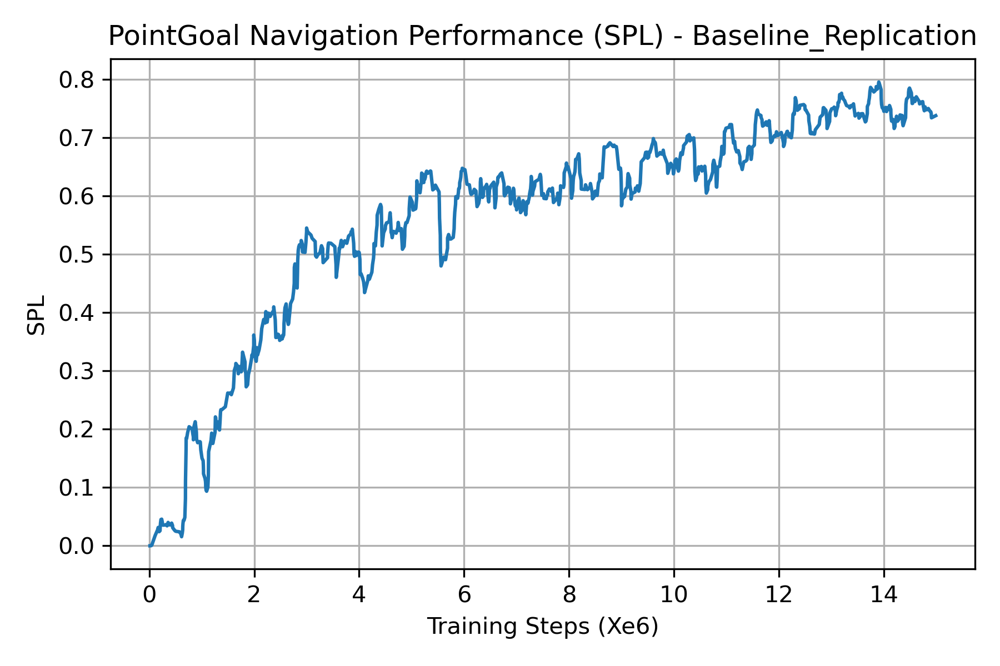
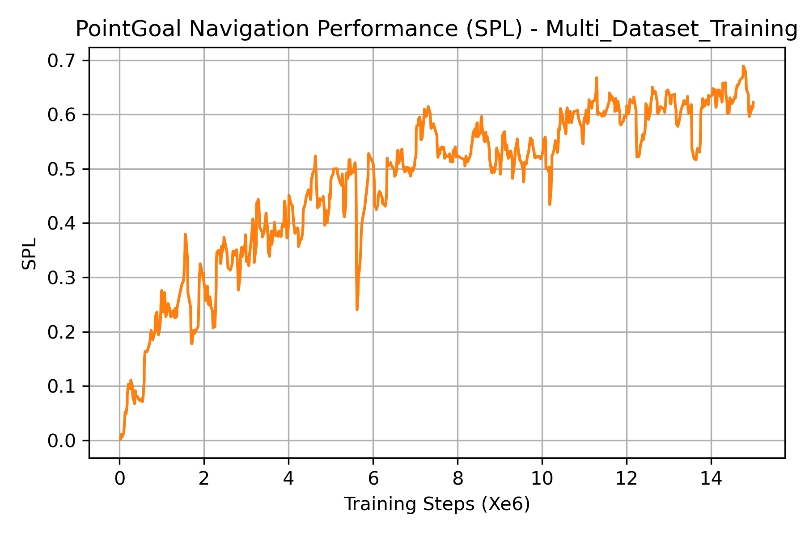

# 📘 **Analyzing Generalization in Habitat PointGoal Navigation**

## 🧭 Overview
This repository contains a replication and analysis of the **Depth-based PPO PointGoal Navigation (PointNav)** agent from the Habitat framework.  
The goal is to study **generalization to unseen environments** under the original Habitat evaluation protocol, with a focus on controlled experiments under limited compute.


## 📄 Abstract
This repository presents a faithful replication of the Depth-based PPO agent for PointGoal Navigation introduced in the Habitat framework.  
Core trends reported in prior work are reproduced in this repo, including the generalization gap between seen and unseen environments, using **Gibson** and **Matterport3D** datasets.

- All experiments are conducted under constrained compute to emphasize controlled analysis rather than large-scale training.  
- This repository also serves as a foundation for lightweight generalization-oriented extensions explored in subsequent work.


## 🎯 Research Objectives
- Replicate the Depth-based PPO PointNav baseline under the original Habitat evaluation protocol.
- Verify generalization behavior when evaluated on unseen environments.
- Quantify the performance gap between in-domain and cross-dataset evaluation.
- Establish a clean experimental baseline for future generalization-oriented extensions.

## 🧠 Baseline Method (Habitat PPO-Depth)
The baseline agent follows the standard Habitat PPO PointNav setup with **Depth-only observations**.

Key components:
- Proximal Policy Optimization (PPO)
- Depth visual input
- Continuous navigation actions
- SPL-based evaluation on unseen environments

All architectural and training details follow the official Habitat baselines implementation.


## 📂 Dataset / Data Collection
The experiments use standard Habitat navigation datasets:

- **Gibson**: Used for training
- **Matterport3D (MP3D)**: Used for cross-dataset evaluation

Both datasets are used with the official Habitat splits to ensure comparability with prior work.
 

<!-- 📁 **Example directory structure:** -->

<!-- >_Example:_
```Datasets/
└── {dataset_name}/
├── train/
│   ├── images/
│   └── labels/
├── validate/
│   ├── images/
│   └── labels/
└── test/
    ├── images/
    └── labels/
```

>_Example:_
>- Images _(samples in general)_ must be `{format}`  
>- Labels must be `{format}` and match filenames of corresponding images

## 🧼 Preprocessing & Augmentation
Explain all preprocessing steps and optional data augmentation applied to the dataset. -->

<!-- ### Preprocessing Steps
>_Example:_
>- Resize images to a fixed resolution without distortion  
>- Apply centered padding  
>- Transpose or flip images if required for dataset consistency  

📌 *Insert preprocessing diagram below:*  
``  
**Figure X:** Caption describing preprocessing steps


### Label Encoding
- Encode labels using `{encoding_method}`  
- Use `{padding_token}` for fixed-length padding if required -->

## 🌳 Project Structure
```text
pointnav-generalization/
├── config/                               # Experiment configuration files
│   ├── gibson_mp3d.yaml
│   ├── habitat.yaml
│   ├── pointnav_gibson_mp3d.yaml
│   ├── ppo_pointnav.yaml
│   └── ppo_pointnav_gibson_mp3d.yaml
│
├── docs/                                 # Documentation and guides
│   ├── Baseline_Replication_spl_curve.png
│   ├── pointnav_replication_and_generalization.md
│   └── setup_gpu.md
│
├── habitat-lab/                          # Habitat submodule (unchanged)
├── outputs/                              # Training outputs (logs, checkpoints, TB files)
│
├── .gitmodules
├── LICENSE
├── README.md
└── tb_display.py                         # Utility script for TensorBoard CSV/plots

```


## 🏋️ Training Instructions


### Setup
1. Install dependencies:
    
    Please follow the environment setup instructions in `docs/`.

## ♻️ Reproducibility and Multi-Dataset Training

Detailed instructions for reproducing the replication and multi-dataset training experiments
are provided in  
[`reproducibility_pointnav_replication_and_multidataset.md`](docs/pointnav_replication_and_generalization.md).


<!-- 2. Training: -->
<!-- ```bash
python train.py --arg1 value1 --arg2 value2
``` -->

<!-- ### Key Training Details

- Batch size: `{batch_size}`
- Learning rate: `{learning_rate}`
- Number of epochs: `{num_epochs}`
- Checkpointing: Save best model as `{checkpoint_name}`
- Early stopping criteria: `{criteria}`
- Optional callbacks: `{callback_names}` -->

<!-- ## 🧪 Evaluation
Describe how to evaluate the trained model and what metrics are reported.

### Evaluation Command
```bash
python evaluate.py --model {checkpoint_path} --data {dataset_path}
```
### Metrics Computed
>_Example_
>- Per-sample predictions
>- Character-level accuracy
>- Global accuracy / overall score
>- Precision, Recall, F1-score (if applicable)
>- Loss curves -->

<!-- ### Inspecting Outputs
>_Example_
>- Decoded outputs for selected samples are saved to `{output_folder}`.   
>-Visualizations can be generated for qualitative analysis. -->

<!-- ## 📊 Results & Discussion -->
## 📊 Results

### Baseline Replication
**Figure 1** illustrates the SPL during training for the baseline PointGoal navigation replication experiment.

<p align="left">
  
</p>

**Table 1** reports the evaluation performance of the depth-based PPO PointGoal navigation agent on unseen environments.

| Model                | SPL    | Success |
|----------------------|--------|---------|
| Habitat (reported)   | 0.79   | 0.89    |
| Replication (ours)   | 0.7275 | 0.84    |

# Multi-Dataset Training
**Figure 2** illustrates the SPL during training for the baseline PointGoal navigation replication experiment.

<p align="left">
  
</p>

**Table 2** reports the evaluation performance of the depth-based PPO PointGoal navigation agent on unseen environments.

| Model                  | Dataset      | SPL        | Success |
|------------------------|--------------|------------|---------|
| Baseline (replication) | Gibson       | 0.7275     | 0.84    |
| Baseline (replication) | Matterport3D | 0.5740     | 0.6949  |
| Modified model (ours)  | Gibson       | **0.7489** | **0.86**|
| Modified model (ours)  | Matterport3D | **0.6940** | **0.8249**|


<!-- ### Qualitative Results
- Show example outputs for key samples  
- Compare predictions with ground truth  
- Highlight common errors or patterns

### Discussion
- Interpret results and explain trends  
- Compare with prior work if relevant  
- Mention limitations observed in the results -->

## ⚙️ Environment & Dependencies
Follow instruction in [`setup_gpu.md`](docs/setup_gpu.md) to setup the experiment environment.


## 📄 License
This repository is licensed under the MIT License. See the [MIT License](LICENSE) file for more details.


## 🙌 Acknowledgements
- This README structure was inspired by the Research README template from
[MohamedElsayed-22/README-templates](https://github.com/MohamedElsayed-22/README-templates).
 - The developers of [facebookresearch/habitat-lab](https://github.com/facebookresearch/habitat-lab) are appreciated for their open-source contributions.  
